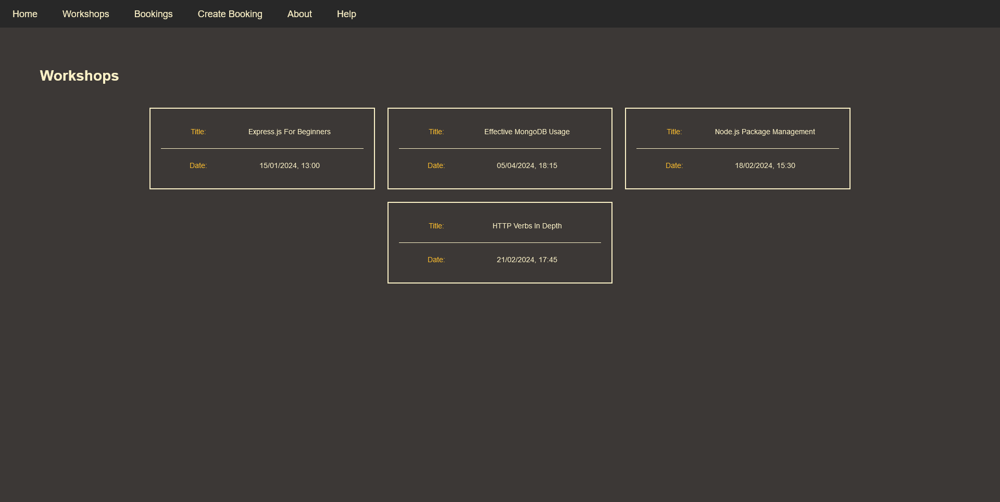
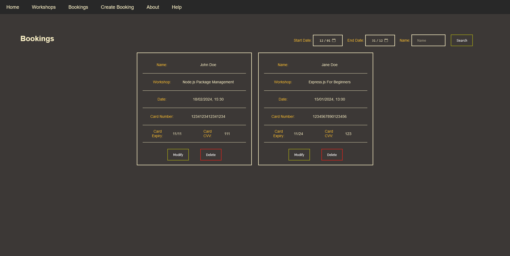
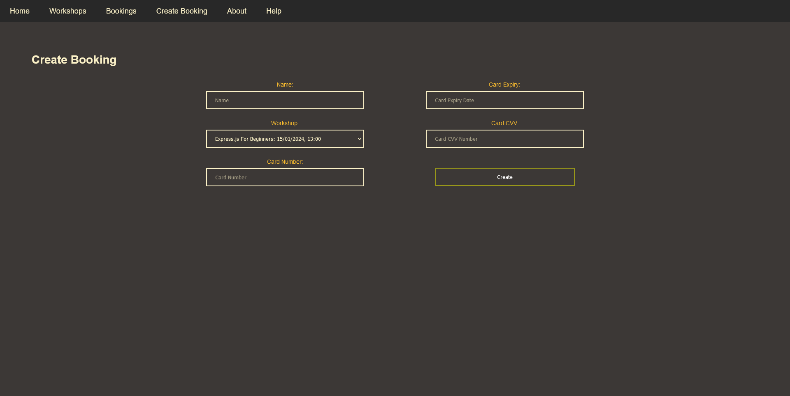

# Workshop Booking Website

This demo project is a workshop booking website that was made with Node, Express and MongoDB.

It features the ability to create bookings, modify bookings and delete bookings with persistence to the MongoDB databse.

It also includes session authentication with users requested to enter a username and password when first accessing the site. Credentials are admin and password (very secure indeed!)

# Running the Project

To run this project locally, clone the repo then run `npm install` to install project dependencies.
Then provide the connection string for your MongoDB server in `app.js` on line 19.
The server can then be launched with `npm run start`.

> [!NOTE]
> The app will automatically create and populate the database given by the connection string with the default workshop data if no records are present in the database. For this reason, I recommend giving a name for the new database in your connection string. Example: mongodb://server:port/nameofnewdatabase

# Screenshots

Below are some screenshots of the website.

## Workshops Page

## Bookings Page

## Create Booking Page

